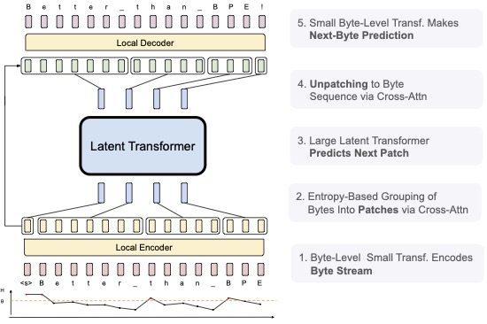

# Byte Latent Transformer

This repository contains code for our paper: "Byte Latent Transformer: Patches Scale Better Than Tokens"

- [Paper Link](https://dl.fbaipublicfiles.com/blt/BLT__Patches_Scale_Better_Than_Tokens.pdf)

## Abstract

We introduce the Byte Latent Transformer architecture (BLTs), a new byte-level LLM architecture that
for the first time, matches tokenization-based LLM performance at scale, with significant improvements
in inference efficiency and robustness. BLT encodes bytes into dynamically sized patches, which serve
as the primary units of computation. Patches are segmented dynamically based on the entropy of the
next byte, allocating more compute and model capacity where there is more data complexity. The BLT
architecture includes new attention mechanisms to maximize the information flow between byte and
patch hidden representations and a new type of byte-sequence memory. We present the first scaling
study of byte-level models up to 8B parameters and 8T training bytes, showing for the first time
that we can train a model end-to-end at scale from bytes with no tokenization or other preprocessing.
Scaling trends reveal training and inference efficiency benefits from dynamically selecting very long
patches on average, along with qualitative improvements with reasoning and long tail generalization
from modeling byte-sequences.



## Development Status

We are actively updating the blt code to make it easier to reproduce our results.
Please file an issue and/or be patient while we make more of our code public!

## Quick start

The following commands launch a SLURM job that creates an environment for Meta Lingua.
The env creation should take around 5 minutes without counting downloads.

```bash
git clone https://github.com/facebookresearch/blt
cd blt

bash setup/create_env.sh
# or if you have access to a SLURM cluster
sbatch setup/create_env.sh
```

Once that is done your can activate the environment

```bash
conda activate blt_<date>
```

use the provided script to download and prepare data from huggingface (among `fineweb_edu`, `fineweb_edu_10bt`, or `dclm_baseline_1.0`).
This command will download the `fineweb_edu` and prepare it for training in the `./data` directory, specifying the amount of memory `terashuf` (the tool used to shuffle samples) will be allocated. By default, the number of chunks (`nchunks`) is 32. If you are running on fewer than 32 GPUs, it is recommended to set `nchunks` to 1 or to match `nchunks` with the number of GPUs (`nchunks` = NGPUs). See [here](https://github.com/facebookresearch/lingua/issues/55#issuecomment-2483643076) for more details.

```bash
python setup/download_prepare_hf_data.py fineweb_edu <MEMORY> --data_dir ./data --seed 42 --nchunks <NCHUNKS>
```

to download tokenizer (here llama3), use the folowing script:

```bash
python setup/download_tokenizer.py llama3 <SAVE_PATH> --api_key <HUGGINGFACE_TOKEN>
```

Now launch a debug job to check if everything works. **The provided configurations are templates, you need to adapt them for them to work (change `dump_dir`, `data.root_dir`, `data.tokenizer.path`, etc ...)**

```bash
# stool stands for SLURM tool !
python -m bytelatent.stool script=bytelatent.train config=apps/bytelatent/configs/debug.yaml nodes=1 partition=<partition>
# if you want to launch locally you can use torchrun
torchrun --nproc-per-node 8 -m bytelatent.train config=apps/bytelatent/configs/debug.yaml
# or you can also launch on 1 GPU
python -m bytelatent.train  config=apps/bytelatent/configs/debug.yaml
```

When using `stool`, if a job crashes, it can be relaunched using sbatch:

```bash
sbatch path/to/dump_dir/submit.slurm
```

## Linting

To lint, run the following command

```
bash dev/lint.sh
```

## Citation

The BLT is partially based on Meta Lingua, so consider citing it in addition to our BLT paper if you re-use our work.

BLT Paper Citation (will be updated to arXiv soon)

```
@article{meta_blt,
  author = {Artidoro Pagnoni, Ram Pasunuru, Pedro Rodriguez, John Nguyen, Benjamin Muller, Margaret Li, Chunting Zhou, Lili Yu, Jason Weston, Luke Zettlemoyer, Gargi Ghosh, Mike Lewis, Ari Holtzman†, Srinivasan Iyer},
  title = {Byte Latent Transformer: Patches Scale Better Than Tokens},
  url = {https://github.com/facebookresearch/blt},
  year = {2024}
}
```

Lingua Code

```
@misc{meta_lingua,
  author = {Mathurin Videau, Badr Youbi Idrissi, Daniel Haziza, Luca Wehrstedt, Jade Copet, Olivier Teytaud, David Lopez-Paz},
  title = {{Meta Lingua}: A minimal {PyTorch LLM} training library},
  url = {https://github.com/facebookresearch/lingua},
  year = {2024}
}
```

## License

The BLT code is partially based on Meta Lingua.

Meta Lingua is licensed under BSD-3-Clause license. Refer to the LICENSE file in the top level directory.
